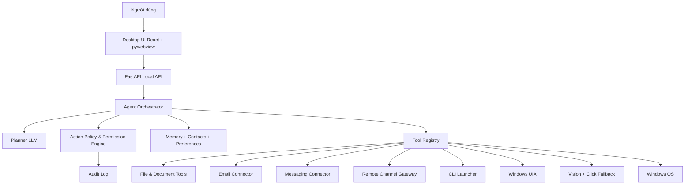
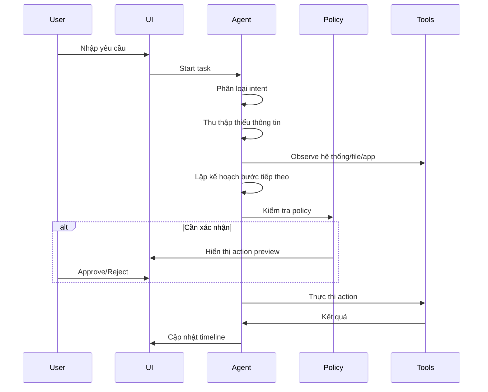

# Kế hoạch Thiết kế & Triển khai CONTROLPC

CONTROLPC là trợ lý ảo cục bộ trên Windows, mục tiêu chính là thay người dùng thực hiện các tác vụ văn phòng đơn giản và lặp lại: mở file, tìm tài liệu, viết báo cáo, gửi email, trả lời tin nhắn, điền biểu mẫu, lưu kết quả và báo cáo lại trạng thái.

Ứng dụng này có thể xem như một phiên bản "OpenClaw thu nhỏ" nhưng hẹp hơn và an toàn hơn: **không tập trung lướt web, không tra cứu internet, không marketplace skill**, chỉ tập trung điều khiển máy tính cục bộ theo lệnh người dùng. Sau giai đoạn desktop, hệ thống sẽ mở rộng thêm lớp nhận lệnh từ điện thoại qua Zalo, WhatsApp hoặc Telegram.

Điểm quan trọng nhất của thiết kế này là **không biến AI thành một con trỏ chuột tự do**. Hệ thống phải luôn ưu tiên các kênh điều khiển chắc chắn, có thể kiểm chứng và ít rủi ro như CLI, API nội bộ, file system, giao thức email, Windows UI Automation hoặc connector chính thống của ứng dụng. Click chuột theo tọa độ chỉ được dùng như phương án cuối cùng, phải xin phép rõ ràng, phải hiển thị vị trí click và phải có cơ chế dừng khẩn cấp.

---

## 1. Mục tiêu Sản phẩm

### 1.1. Mục tiêu chính

CONTROLPC cần làm tốt các nhóm việc sau:

- Mở ứng dụng và file: mở Word, Excel, PDF, ảnh, thư mục, file dự án, file báo cáo, đường dẫn mạng nội bộ.
- Tìm kiếm file: tìm theo tên, phần mở rộng, thư mục, thời gian sửa, nội dung cơ bản nếu có thể lập chỉ mục.
- Viết báo cáo: tạo nháp báo cáo từ yêu cầu người dùng, dữ liệu nhập tay, file mẫu, hoặc nội dung file hiện có.
- Gửi email: soạn email, đính kèm file, gửi cho người nhận đã xác nhận.
- Trả lời tin nhắn: hỗ trợ soạn nháp trả lời trên các ứng dụng chat desktop hoặc kênh điều khiển từ điện thoại; tự gửi chỉ khi quyền cho phép.
- Quản lý file đầu ra: lưu file đúng thư mục, đặt tên theo quy tắc, mở preview, hỏi xác nhận trước khi gửi.
- Báo cáo tiến độ: cho người dùng thấy agent đang định làm gì, đã làm gì, còn chờ gì.
- Nhận lệnh từ xa: nhận lệnh từ số điện thoại/tài khoản đã xác thực qua Telegram, WhatsApp hoặc Zalo, sau đó chuyển thành task local có kiểm duyệt.

### 1.2. Không làm trong giai đoạn đầu

- Không tự ý xử lý giao dịch tài chính, mua hàng, chuyển tiền, ký hợp đồng, xóa dữ liệu hàng loạt.
- Không tự ý gửi email/tin nhắn nhạy cảm nếu chưa có xác nhận cuối.
- Không tự ý click các nút nguy hiểm như Delete, Send, Submit, Pay, Confirm, Accept All nếu không có quyền phù hợp.
- Không cố điều khiển mọi phần mềm bằng tọa độ chuột. Tọa độ là fallback, không phải chiến lược chính.
- Không dùng AI để tự do lướt web, tra cứu internet hoặc tự động tương tác website không liên quan đến tác vụ local đã được người dùng yêu cầu.
- Không cài skill/plugin từ nguồn ngoài trong giai đoạn đầu.

### 1.3. Tiêu chí thành công

- Người dùng có thể nói: "Viết báo cáo công việc hôm nay rồi gửi cho anh Nam", hệ thống sẽ hỏi thiếu thông tin, tạo file, cho xem lại, xin xác nhận và gửi email.
- Người dùng có thể nói: "Mở file báo giá mới nhất trong thư mục dự án A", hệ thống tìm file, hiển thị ứng viên, mở file đúng bằng cơ chế hệ thống.
- Người dùng có thể nói: "Trả lời tin nhắn này là tôi sẽ gửi trước 5 giờ", hệ thống soạn nháp, hiển thị nội dung, chỉ gửi khi được phép.
- Mọi hành động có rủi ro đều có log, trạng thái, quyền và nút dừng.
- Lệnh từ điện thoại chỉ được chấp nhận từ tài khoản allowlist và phải có xác nhận bổ sung với tác vụ rủi ro cao.

---

## 2. Nguyên tắc Điều khiển Máy tính

### 2.1. Thứ tự ưu tiên hành động

CONTROLPC phải chọn kênh điều khiển theo thứ tự sau:

1. **API hoặc giao thức chính thức**
   - Email qua SMTP/IMAP, Microsoft Graph, Gmail API nếu được cấu hình.
   - Telegram Bot API, WhatsApp Business API, Zalo OA/API nếu được cấu hình hợp lệ.
   - Office/PDF qua thư viện file thay vì mở UI nếu chỉ cần tạo/chỉnh tài liệu.
   - Outlook COM hoặc API ứng dụng desktop nếu ổn định hơn thao tác UI.

2. **CLI và file system**
   - Mở file bằng `os.startfile`.
   - Mở ứng dụng bằng đường dẫn executable đã biết.
   - Tạo, đổi tên, copy, nén, lưu file bằng API hệ điều hành.
   - Chạy command đã allowlist.

3. **Windows UI Automation (UIA)**
   - Tìm control theo `AutomationId`, `Name`, `ControlType`, `ClassName`.
   - Click vào button hoặc nhập text theo cây UI.
   - Phù hợp với app desktop có UIA tốt.

4. **Hotkey**
   - Dùng khi app có phím tắt ổn định: `Ctrl+S`, `Ctrl+O`, `Alt+F4`, `Tab`, `Enter`, phím tắt phần mềm chuyên dụng.
   - Phải có focus app rõ ràng trước khi gửi hotkey.

5. **Vision + click tọa độ**
   - Chỉ dùng khi 4 cách trên không khả thi.
   - Phải có screenshot, bounding box, mô tả lý do, xác nhận người dùng.
   - Không dùng cho hành động gửi/xóa/xác nhận nếu chưa có xác nhận cuối.

Không có tầng "web browsing tự do" trong thứ tự ưu tiên. Nếu một tác vụ cần tương tác với dịch vụ online, nó phải đi qua connector cụ thể đã cấu hình và được policy cho phép, ví dụ email connector hoặc Telegram connector.

### 2.2. Phân biệt quyền CLI và click chuột

| Kênh | Độ ưu tiên | Mức rủi ro mặc định | Khi nào dùng | Yêu cầu xác nhận |
|---|---:|---:|---|---|
| Đọc file/thư mục | Cao | Thấp | Tìm file, đọc dữ liệu đầu vào | Không cần nếu trong thư mục cho phép |
| Tạo file nháp | Cao | Thấp | Viết báo cáo, tạo bản draft | Không cần hoặc xác nhận nhẹ |
| Mở file/app bằng CLI | Cao | Thấp/Trung bình | Mở Word/PDF/Excel/app | Không cần nếu app/file nằm trong allowlist |
| Gửi email qua API | Cao | Cao | Gửi email thật | Luôn cần xác nhận cuối |
| Nhận lệnh từ điện thoại | Cao | Trung bình/Cao | Tạo task từ Telegram/Zalo/WhatsApp | Cần xác thực sender, tác vụ high-risk cần xác nhận |
| UIA click control rõ ràng | Trung bình | Trung bình | Click nút được nhận diện bằng tên/id | Cần xác nhận nếu action rủi ro |
| Hotkey | Trung bình | Trung bình | Lưu, copy, chuyển tab, gửi shortcut | Cần app focus và action policy |
| Click tọa độ | Thấp nhất | Cao | Fallback khi không có API/UIA | Luôn cần xác nhận, hiển thị preview |

### 2.3. Luật an toàn bắt buộc

- Mọi action phải đi qua `ActionPolicy` trước khi chạy.
- Mọi action phải có `action_id`, `risk_level`, `target`, `reason`, `rollback_hint`.
- Action mức cao như gửi email, gửi tin nhắn, xóa file, ghi đè file, upload file phải có xác nhận cuối.
- Agent phải có nút Stop/Emergency Stop luôn hiển thị.
- Không lưu mật khẩu thô trong JSON. Dùng Windows Credential Manager hoặc biến môi trường được mã hóa.
- Không tự động vượt qua CAPTCHA, MFA, xác nhận bảo mật.
- Không cho lệnh từ điện thoại chạy trực tiếp shell/click nếu chưa qua policy và confirmation.
- Mọi remote command phải có `source_channel`, `sender_id`, `auth_level`, `task_id`.

---

## 3. Luồng Công việc Người dùng

### 3.1. Gửi email có file đính kèm

Ví dụ lệnh:

> "Viết email gửi anh Nam báo cáo tiến độ hôm nay, đính kèm file báo cáo vừa tạo."

Luồng chuẩn:

1. Agent phân loại tác vụ: `email_send_with_attachment`.
2. Agent hỏi thông tin thiếu:
   - Người nhận là ai?
   - Email cụ thể nào nếu danh bạ có nhiều người tên Nam?
   - Nội dung có cần trang trọng hay ngắn gọn?
   - File nào cần đính kèm?
3. Agent tạo nháp email.
4. Agent hiển thị preview:
   - To, CC, BCC
   - Subject
   - Body
   - Attachments
5. Agent kiểm tra file đính kèm tồn tại, dung lượng, phần mở rộng.
6. Agent xin xác nhận cuối: "Gửi email này?"
7. Sau khi người dùng đồng ý, gửi qua email connector/API.
8. Lưu log: thời gian, người nhận, subject, file đính kèm, trạng thái gửi.

Không dùng click chuột để bấm nút Send nếu đã có SMTP/API. Nếu bắt buộc dùng Outlook UI, phải ưu tiên UIA control `Send` và xác nhận cuối.

### 3.2. Trả lời tin nhắn

Ví dụ lệnh:

> "Trả lời tin nhắn của chị Hằng là em sẽ gửi báo cáo trước 5 giờ."

Luồng chuẩn:

1. Agent xác định kênh: app desktop đang mở, Telegram bot, WhatsApp Business, Zalo OA/API, hoặc connector nội bộ khác.
2. Nếu có API/connector chính thống thì dùng connector.
3. Nếu không có API, dùng UIA để tìm cửa sổ chat desktop.
4. Agent soạn nháp nội dung.
5. Agent hiển thị preview nội dung.
6. Tùy quyền:
   - `draft_only`: chỉ điền vào ô chat, không gửi.
   - `confirm_before_send`: điền và hỏi xác nhận trước khi Enter/Send.
   - `auto_send_allowed`: chỉ áp dụng cho liên hệ/nhóm đã allowlist.
7. Lưu log trạng thái.

Không dùng browser automation tự do để điều khiển web chat trong giai đoạn MVP. Nếu cần hỗ trợ một kênh chat cụ thể, phải viết connector riêng cho kênh đó và đưa vào permission model.

### 3.3. Mở file

Ví dụ lệnh:

> "Mở file báo giá mới nhất của dự án The Sun."

Luồng chuẩn:

1. Agent tìm trong các thư mục allowlist: Desktop, Documents, Downloads, thư mục dự án đã cấu hình.
2. Nếu có nhiều ứng viên, hiển thị danh sách:
   - tên file
   - đường dẫn
   - ngày sửa
   - dung lượng
3. Người dùng chọn hoặc agent chọn theo quy tắc "mới nhất".
4. Mở bằng `os.startfile` hoặc app mặc định.
5. Không click desktop icon theo tọa độ.

### 3.4. Viết báo cáo rồi gửi file

Ví dụ lệnh:

> "Tổng hợp các ý này thành báo cáo Word, lưu vào thư mục dự án rồi gửi cho quản lý."

Luồng chuẩn:

1. Agent hiểu loại báo cáo: ngày/tuần/tháng/tiến độ/sự cố/bàn giao.
2. Agent thu thập dữ liệu:
   - nội dung người dùng đưa
   - file nguồn người dùng chọn
   - template có sẵn
   - lịch sử/ghi chú trong memory nếu được phép
3. Agent tạo nháp báo cáo.
4. Agent lưu file vào `workspace/output` hoặc thư mục dự án.
5. Agent mở preview hoặc xuất PDF nếu cần.
6. Agent hỏi xác nhận trước khi gửi.
7. Agent gửi qua email/API hoặc tạo draft email nếu chưa đủ quyền.

### 3.5. Nhận lệnh từ điện thoại

Ví dụ lệnh qua Telegram/Zalo/WhatsApp:

> "Máy tính ơi, tạo báo cáo hôm nay rồi gửi draft cho tôi xem."

Luồng chuẩn:

1. Remote gateway nhận tin nhắn.
2. Kiểm tra `source_channel` và `sender_id` có nằm trong allowlist không.
3. Phân loại quyền của sender:
   - `view_status`: chỉ xem trạng thái.
   - `create_task`: được tạo task low/medium risk.
   - `approve_high_risk`: được xác nhận gửi email/tin nhắn hoặc ghi đè file.
   - `admin`: cấu hình connector và permission.
4. Tạo task local, không chạy trực tiếp từ message.
5. Nếu task low-risk, agent có thể chạy theo policy.
6. Nếu task high-risk, agent gửi lại preview và yêu cầu xác nhận bằng mã PIN/OTP hoặc nút approve.
7. Gửi kết quả tóm tắt về điện thoại: thành công, thất bại, file đã tạo, action cần duyệt.

Lệnh từ điện thoại không được tự do chạy command shell, không được click tọa độ trực tiếp, không được gửi email/tin nhắn thật nếu chưa có xác nhận cuối.

---

## 4. Kiến trúc Tổng thể



### 4.1. Các lớp chính

- **UI Layer**: chat, timeline, pending actions, preview email/file, screenshot, emergency stop.
- **API Layer**: FastAPI endpoints, WebSocket/SSE, session state.
- **Agent Orchestrator**: quản lý vòng đời task, chia nhỏ bước, chạy tool, lưu kết quả.
- **Planner LLM**: hiểu yêu cầu, sinh kế hoạch, chọn tool.
- **Action Policy**: kiểm tra quyền, risk, confirmation, allowlist/blocklist.
- **Tool Registry**: danh sách tool có schema rõ ràng.
- **Memory**: danh bạ, app path, folder allowlist, template báo cáo, lịch sử tác vụ.
- **Audit Log**: log không sửa tay dễ dàng, phục vụ truy vết.
- **Remote Gateway**: nhận lệnh từ Zalo/WhatsApp/Telegram, xác thực sender và chuyển thành task local.

---

## 5. Cấu trúc Thư mục Đề xuất

```text
C:\1 CODE\CONTROLPC\
├── backend/
│   ├── app/
│   │   ├── main.py
│   │   ├── api/
│   │   │   ├── routes_agent.py
│   │   │   ├── routes_files.py
│   │   │   ├── routes_settings.py
│   │   │   └── routes_health.py
│   │   ├── agent/
│   │   │   ├── orchestrator.py
│   │   │   ├── planner.py
│   │   │   ├── executor.py
│   │   │   ├── prompts.py
│   │   │   ├── schemas.py
│   │   │   └── state.py
│   │   ├── policy/
│   │   │   ├── action_policy.py
│   │   │   ├── permissions.py
│   │   │   ├── risk.py
│   │   │   └── validators.py
│   │   ├── tools/
│   │   │   ├── registry.py
│   │   │   ├── file_tool.py
│   │   │   ├── document_tool.py
│   │   │   ├── email_tool.py
│   │   │   ├── messaging_tool.py
│   │   │   ├── remote_gateway_tool.py
│   │   │   ├── cli_tool.py
│   │   │   ├── uia_tool.py
│   │   │   ├── hotkey_tool.py
│   │   │   └── vision_click_tool.py
│   │   ├── core/
│   │   │   ├── config.py
│   │   │   ├── logging.py
│   │   │   ├── secrets.py
│   │   │   └── errors.py
│   │   ├── database/
│   │   │   ├── db.py
│   │   │   ├── models.py
│   │   │   ├── migrations/
│   │   │   └── repositories/
│   │   └── integrations/
│   │       ├── gmail.py
│   │       ├── outlook.py
│   │       ├── smtp_imap.py
│   │       ├── contacts.py
│   │       ├── telegram.py
│   │       ├── whatsapp.py
│   │       └── zalo.py
│   ├── models/
│   ├── tests/
│   ├── requirements.txt
│   └── run_backend.py
├── frontend/
│   ├── src/
│   │   ├── components/
│   │   │   ├── ChatPanel.jsx
│   │   │   ├── ActionApproval.jsx
│   │   │   ├── EmailPreview.jsx
│   │   │   ├── FilePreview.jsx
│   │   │   ├── PermissionBadge.jsx
│   │   │   ├── LiveScreen.jsx
│   │   │   └── SettingsPanel.jsx
│   │   ├── api/
│   │   │   └── client.js
│   │   ├── state/
│   │   ├── App.jsx
│   │   └── main.jsx
│   ├── package.json
│   └── vite.config.js
├── remote_gateway/
│   ├── telegram_bot.py
│   ├── whatsapp_adapter.py
│   ├── zalo_adapter.py
│   └── gateway_config.example.json
├── workspace/
│   ├── input/
│   ├── output/
│   ├── templates/
│   └── temp/
├── config/
│   ├── permissions.example.json
│   ├── app_paths.example.json
│   └── folders.example.json
├── docs/
├── desktop.py
├── start.bat
└── .gitignore
```

---

## 6. Action Schema Chuẩn

Mọi tool call phải dùng schema chung:

```json
{
  "action_id": "act_20260611_0001",
  "tool": "email.send",
  "intent": "send_report_email",
  "risk_level": "high",
  "requires_confirmation": true,
  "target": {
    "app": "email",
    "recipient": "nam@example.com",
    "file": "C:\\Project\\report.docx"
  },
  "params": {},
  "reason": "Người dùng yêu cầu gửi báo cáo cho anh Nam.",
  "preview": {
    "title": "Gửi email báo cáo",
    "summary": "Gửi 1 email có 1 file đính kèm."
  },
  "rollback_hint": "Không thể thu hồi chắc chắn sau khi gửi email."
}
```

### 6.1. Risk levels

- `low`: đọc file, tìm file, tạo nháp, mở file allowlist.
- `medium`: ghi file, đổi tên file, mở app ngoài allowlist, thao tác UIA không gửi/xóa.
- `high`: gửi email/tin nhắn, upload file, ghi đè file, xóa file, chạy command có tác dụng hệ thống.
- `blocked`: thao tác không được phép như xóa thư mục hệ thống, gửi mật khẩu, chạy script chưa xác minh.

### 6.2. Confirmation modes

- `none`: chạy ngay nếu low-risk và trong allowlist.
- `notify`: chạy và thông báo.
- `confirm_once`: hỏi một lần cho action cụ thể.
- `confirm_final`: dùng cho gửi/xóa/submit.
- `manual_only`: agent chỉ hướng dẫn, không tự chạy.

### 6.3. Remote command schema

Mọi lệnh đến từ điện thoại phải được chuẩn hóa trước khi đưa vào agent:

```json
{
  "remote_command_id": "rc_20260611_0001",
  "source_channel": "telegram",
  "sender_id": "123456789",
  "sender_display_name": "Owner",
  "auth_level": "create_task",
  "received_text": "Tạo báo cáo hôm nay rồi gửi draft cho tôi xem",
  "normalized_task": "Tạo báo cáo công việc hôm nay và tạo email draft để người dùng xem lại.",
  "requires_local_confirmation": false,
  "created_task_id": "task_20260611_0001"
}
```

Remote gateway không được gửi thẳng lệnh xuống `cli_tool`, `hotkey_tool`, `uia_tool` hoặc `vision_click_tool`. Nó chỉ được tạo task và đẩy task vào policy engine.

---

## 7. Permission Model

### 7.1. File permissions

File access chia theo vùng:

- `allowed_read_dirs`: thư mục được đọc.
- `allowed_write_dirs`: thư mục được ghi/tạo file.
- `blocked_dirs`: thư mục cấm đọc/ghi, ví dụ `C:\Windows`, `C:\Program Files`, thư mục chứa credentials.
- `max_attachment_mb`: giới hạn dung lượng file gửi đi.
- `allowed_extensions`: ví dụ `.docx`, `.xlsx`, `.pdf`, `.txt`, `.png`, `.jpg`.

### 7.2. App permissions

Mỗi ứng dụng có policy:

```json
{
  "outlook": {
    "launch": "allow",
    "uia": "allow",
    "hotkey": "confirm",
    "coordinate_click": "confirm_final"
  },
  "cmd": {
    "launch": "confirm",
    "allowed_commands": ["dir", "where", "start", "python --version"]
  }
}
```

### 7.3. Contact permissions

Danh bạ cần phân quyền:

- `draft_only`: chỉ viết nháp.
- `confirm_before_send`: luôn hỏi trước khi gửi.
- `auto_send_allowed`: chỉ dùng cho liên hệ tin cậy và nội dung low-risk.
- `blocked`: không tự động gửi.

### 7.4. Remote sender permissions

Mỗi tài khoản/số điện thoại điều khiển từ xa phải có quyền riêng:

```json
{
  "telegram:123456789": {
    "name": "Owner",
    "enabled": true,
    "auth_level": "admin",
    "can_create_task": true,
    "can_approve_high_risk": true,
    "requires_pin_for_high_risk": true
  },
  "whatsapp:+84901234567": {
    "name": "Owner Phone",
    "enabled": true,
    "auth_level": "create_task",
    "can_create_task": true,
    "can_approve_high_risk": false,
    "requires_pin_for_high_risk": true
  }
}
```

Quy tắc:

- Sender không nằm trong allowlist bị từ chối.
- Sender chỉ có quyền `create_task` không được approve gửi email/tin nhắn thật.
- Lệnh nguy hiểm qua điện thoại phải yêu cầu PIN/OTP hoặc xác nhận trong desktop UI.
- Nếu remote channel bị lỗi xác thực, agent chuyển về chế độ local-only.

---

## 8. Tool Registry Cần Có

### 8.1. File Tool

Chức năng:

- `file.search`
- `file.open`
- `file.copy`
- `file.rename`
- `file.create_folder`
- `file.preview_metadata`

Yêu cầu:

- Không tìm toàn ổ đĩa mặc định. Chỉ tìm trong thư mục allowlist.
- Có giới hạn số kết quả và thời gian.
- Có cache index file để tìm nhanh.

### 8.2. Document Tool

Chức năng:

- `document.create_docx`
- `document.create_pdf`
- `document.read_text`
- `document.summarize`
- `document.fill_template`

Yêu cầu:

- Ưu tiên tạo file bằng thư viện thay vì mở Word để gõ bằng UI.
- Hỗ trợ template báo cáo.
- Có preview nội dung trước khi gửi.

### 8.3. Email Tool

Chức năng:

- `email.create_draft`
- `email.send`
- `email.validate_recipient`
- `email.attach_file`
- `email.list_recent`

Yêu cầu:

- Gửi email thật luôn là high-risk.
- Không gửi nếu thiếu người nhận, subject, body hoặc file đính kèm không tồn tại.
- Có preview đầy đủ.
- Hỗ trợ SMTP/IMAP trước, sau đó Outlook/Gmail/Microsoft Graph.

### 8.4. Messaging Tool

Chức năng:

- `message.create_draft`
- `message.send`
- `message.find_contact`
- `message.open_thread`

Yêu cầu:

- Giai đoạn đầu nên ưu tiên draft, không auto-send.
- Với app không có API, dùng UIA trên app desktop đã allowlist.
- Không dùng coordinate click để bấm gửi nếu chưa có xác nhận.

### 8.4.1. Remote Gateway Tool

Chức năng:

- `remote.receive_command`
- `remote.authenticate_sender`
- `remote.create_local_task`
- `remote.send_status`
- `remote.request_confirmation`
- `remote.verify_pin`

Kênh ưu tiên:

1. Telegram Bot API: dễ triển khai, có `chat_id`, webhook/polling rõ ràng.
2. WhatsApp Business API: ưu tiên đường chính thống; tránh phụ thuộc WhatsApp Web automation trong MVP.
3. Zalo OA/API: chỉ dùng nếu cấu hình hợp lệ và kiểm soát được sender.

Yêu cầu:

- Remote gateway chỉ là lớp nhận lệnh/gửi trạng thái, không phải agent riêng.
- Không có quyền trực tiếp click chuột, gõ phím, chạy shell.
- Mọi remote command phải được đưa vào `ActionPolicy`.
- Mọi high-risk remote action phải có xác nhận cuối.
- Có rate limit để tránh spam lệnh.
- Có audit log theo `source_channel` và `sender_id`.

### 8.5. CLI Tool

Chức năng:

- `cli.open_app`
- `cli.open_file`
- `cli.run_allowlisted`

Yêu cầu:

- Chỉ chạy command allowlist.
- Command có redirect, pipe, delete, format, registry edit, powershell script lạ phải bị chặn hoặc yêu cầu quyền cao.
- Log đầy đủ command và output rút gọn.

### 8.6. UIA Tool

Chức năng:

- `uia.list_windows`
- `uia.get_control_tree`
- `uia.click_control`
- `uia.type_into_control`

Yêu cầu:

- Không import cứng `win32gui` nếu package thiếu. Backend vẫn phải chạy và báo UIA unavailable.
- Cache UI tree theo cửa sổ.
- Hiển thị control target trước khi click action rủi ro.

### 8.7. Vision Click Tool

Chức năng:

- `vision.screenshot`
- `vision.locate_text_or_button`
- `vision.propose_click`
- `vision.click_confirmed`

Yêu cầu:

- Luôn yêu cầu xác nhận.
- Hiển thị screenshot kèm marker.
- Chỉ click sau khi người dùng duyệt đúng marker.
- Không dùng cho gửi/xóa/submit nếu có tool khác khả thi.

### 8.8. Tool không có trong MVP

Các tool sau không nằm trong MVP:

- Web search.
- Autonomous browser browsing.
- Plugin/skill marketplace.
- Tự tải/cài extension từ nguồn ngoài.
- Tự động vượt CAPTCHA/MFA.
- Tự điều khiển website không thuộc connector đã cấu hình.

---

## 9. Agent Loop Đề xuất



### 9.1. Trạng thái task

- `idle`
- `planning`
- `waiting_user_input`
- `waiting_approval`
- `running_tool`
- `verifying`
- `completed`
- `failed`
- `stopped`

### 9.2. Luật vận hành

- Không dùng global mutable state không lock.
- Mỗi task có `task_id`.
- Mỗi action có `action_id`.
- Background worker lấy action từ queue.
- API approve/reject phải kiểm tra `task_id` và `action_id`.
- Stop phải hủy queue và vô hiệu hóa pending action hiện tại.

---

## 10. Giao diện Người dùng

Giao diện CONTROLPC phải là giao diện làm việc sáng, sạch, dễ đọc, không dùng dark theme làm mặc định. Đây là công cụ văn phòng/agent điều khiển máy, nên UI cần cảm giác tin cậy, nhẹ, rõ trạng thái và dễ kiểm soát. Không thiết kế theo kiểu cyberpunk, terminal tối màu, neon, glassmorphism nặng hoặc dashboard quá trang trí.

### 10.1. Màn hình chính

Cần có:

- Khung chat chính.
- Timeline hành động.
- Panel hành động chờ duyệt.
- Preview email/tin nhắn/file.
- Trạng thái agent.
- Nút Stop lớn, dễ thấy.
- Badge mode: `API`, `CLI`, `UIA`, `Hotkey`, `Click`, `Remote`.

Bố cục desktop đề xuất:

```text
┌──────────────────────────────────────────────────────────────────────────────┐
│ Top Bar: CONTROLPC | Agent status | Active task | Stop | Settings           │
├───────────────────────────────┬──────────────────────────────────────────────┤
│ Chat Panel                    │ Context / Approval Panel                     │
│ - User messages               │ - Pending action card                        │
│ - Assistant replies           │ - Email/message/file preview                 │
│ - Suggested quick actions     │ - Risk explanation                           │
│ - Input composer              │ - Live screen/target preview when needed     │
├───────────────────────────────┴──────────────────────────────────────────────┤
│ Bottom Activity Timeline: last actions, tool mode, result, duration          │
└──────────────────────────────────────────────────────────────────────────────┘
```

Tỉ lệ layout:

- Desktop rộng: chat 58-64%, context panel 36-42%.
- Laptop nhỏ: chat 62%, context panel 38%.
- Mobile/tablet sau này: chat là màn chính, context/approval mở bằng bottom sheet.
- Chiều cao top bar: 56-64 px.
- Composer: 64-96 px tùy có attachment hay không.
- Activity timeline: 48-96 px, có thể collapse.

### 10.1.1. Visual style light theme

Không dùng dark theme. Theme mặc định:

```css
:root {
  --bg-page: #f6f8fb;
  --bg-surface: #ffffff;
  --bg-subtle: #eef3f8;
  --border: #d8e0ea;
  --border-strong: #b8c4d4;
  --text-main: #172033;
  --text-muted: #617084;
  --primary: #2563eb;
  --primary-soft: #e8f0ff;
  --success: #16803c;
  --success-soft: #e8f7ee;
  --warning: #b7791f;
  --warning-soft: #fff4db;
  --danger: #c2413a;
  --danger-soft: #fdebea;
  --remote: #6f42c1;
  --remote-soft: #f1eaff;
}
```

Yêu cầu UI:

- Nền chính sáng xám xanh rất nhẹ `#f6f8fb`.
- Card/panel nền trắng, border nhẹ, shadow rất nhẹ.
- Text chính đậm vừa, dễ đọc.
- Không dùng gradient rực, không dùng glow, không dùng nền đen.
- Border radius 8 px cho panel/card; button 6-8 px.
- Font đề xuất: `Inter`, `Segoe UI`, hoặc system font.
- Kích thước chữ:
  - Body: 14-15 px.
  - Chat message: 14.5-15.5 px.
  - Heading panel: 15-16 px.
  - Metadata/timestamp: 12 px.
- Không dùng animation phức tạp. Chỉ dùng transition 120-180 ms cho hover/focus.

### 10.1.2. Chat Panel

Chat panel là trung tâm điều khiển. Cần có:

- Header nhỏ trong panel: tên task hiện tại, trạng thái, thời gian chạy.
- Message list cuộn mượt.
- Tin nhắn người dùng nằm bên phải, nền xanh nhạt hoặc xanh chính nhẹ.
- Tin nhắn assistant nằm bên trái, nền trắng, border nhẹ.
- Tin hệ thống/timeline ngắn nằm giữa hoặc trong activity timeline, không chen quá nhiều vào chat.
- Composer có:
  - ô nhập nhiều dòng
  - nút gửi
  - nút đính kèm file
  - nút chọn chế độ: `Ask`, `Do`, `Draft`
  - gợi ý quick actions: "Tạo báo cáo", "Tìm file", "Soạn email", "Mở app"

Luật UX cho composer:

- Enter gửi, Shift+Enter xuống dòng.
- Khi agent đang chạy high-risk action, composer vẫn cho phép người dùng nhắn "dừng", "hủy", "chờ tôi".
- Nút Stop không bị disable trong mọi trạng thái running/waiting.
- Nếu remote gateway đang bật, hiển thị chip "Remote: Telegram connected" hoặc "Remote off".

### 10.1.3. Context / Approval Panel

Panel bên phải không phải nơi trang trí; đây là nơi kiểm soát rủi ro.

Các tab đề xuất:

- `Action`: action đang chờ duyệt.
- `Preview`: email/tin nhắn/file/report preview.
- `Screen`: screenshot/target marker nếu cần UIA/click.
- `Details`: JSON/action metadata cho dev/debug.

Khi không có action chờ duyệt:

- Hiển thị task summary.
- Hiển thị file đầu ra gần nhất.
- Hiển thị trạng thái connector: Email, Telegram, Zalo, WhatsApp.
- Hiển thị quyền hiện tại: local-only, remote enabled, high-risk confirmation on.

Khi có action chờ duyệt:

- Card phải nổi bật nhưng không gây hoảng.
- Có nhãn risk rõ:
  - Low: xanh lá.
  - Medium: vàng/cam.
  - High: đỏ.
  - Remote: tím.
- Có câu giải thích ngắn: "Vì action này sẽ gửi email thật, cần xác nhận cuối."
- Nút chính:
  - `Approve`
  - `Reject`
  - `Edit`
  - `Stop Task`
- Với email/tin nhắn: `Edit` phải cho sửa nội dung trước khi approve.
- Với click tọa độ: phải có screenshot marker và tọa độ cụ thể.

### 10.1.4. Activity Timeline

Timeline cần hiển thị mọi bước quan trọng:

| Thời gian | Tool | Hành động | Kết quả | Rủi ro |
|---|---|---|---|---|
| 10:21:03 | file.search | Tìm báo cáo tháng 6 | 3 kết quả | low |
| 10:21:10 | document.create_docx | Tạo báo cáo | Thành công | low |
| 10:21:20 | email.send | Chờ xác nhận gửi | Pending | high |

Yêu cầu:

- Mỗi dòng có icon tool.
- Có trạng thái: pending, running, success, failed, blocked.
- Có thời lượng action nếu đo được.
- Click vào dòng mở detail panel.
- Không đưa quá nhiều log kỹ thuật vào chat chính.

### 10.1.5. Empty states

Khi mới mở app:

- Không dùng landing page marketing.
- Hiển thị ngay chat composer.
- Bên phải hiển thị checklist setup:
  - Email connector: chưa cấu hình/đã cấu hình.
  - Folder permissions: chưa cấu hình/đã cấu hình.
  - Remote gateway: off/on.
  - Model: mock/local model.
- Có 4 nút hành động nhanh:
  - "Tìm file"
  - "Viết báo cáo"
  - "Soạn email"
  - "Cấu hình Telegram"

### 10.1.6. Accessibility và usability

- Contrast text đạt mức đọc tốt trên nền sáng.
- Button nguy hiểm không chỉ dựa vào màu, phải có text rõ.
- Không tự động scroll làm mất phần user đang đọc nếu người dùng đã kéo lên.
- Mọi icon lạ phải có tooltip.
- Phím tắt:
  - `Ctrl+Enter`: gửi message.
  - `Esc`: đóng modal hoặc hủy selection, không stop task ngay.
  - `Ctrl+.`: mở command palette.
- Không dùng toast biến mất quá nhanh cho thông tin quan trọng. High-risk phải nằm trong approval panel.

### 10.2. Action Approval Card

Mỗi action chờ duyệt phải hiển thị:

- Agent định làm gì.
- Dùng kênh nào: API/CLI/UIA/Hotkey/Click.
- Vì sao chọn kênh đó.
- Mức rủi ro.
- Target cụ thể.
- Preview nội dung nếu là email/tin nhắn.
- Nút Approve, Reject, Edit, Stop.

Mẫu nội dung card:

```text
Action cần duyệt

Loại: Gửi email thật
Kênh: Email API
Risk: High
Người nhận: nam@example.com
File đính kèm: C:\Project\report.docx

Lý do cần duyệt:
Email sau khi gửi có thể không thu hồi chắc chắn.

[Edit] [Reject] [Approve and Send]
```

Với click tọa độ:

```text
Action cần duyệt

Loại: Click tọa độ
Kênh: Vision + Click
Risk: High
Tọa độ: x=1420, y=816
Mục tiêu AI nhận diện: nút "Attach"

Yêu cầu:
- Hiển thị screenshot.
- Marker đúng vị trí.
- Người dùng phải xác nhận marker trước khi click.

[Reject] [Approve Click]
```

### 10.3. Settings

Cần cấu hình:

- Model path.
- Email account connector.
- Thư mục đọc/ghi cho phép.
- Danh bạ và quyền gửi.
- App paths.
- Mức tự động hóa mặc định.
- Bật/tắt coordinate click.

Settings chia thành nhóm:

- `General`: language, startup mode, local model/mock mode.
- `Permissions`: folder allowlist, blocked dirs, max attachment size.
- `Email`: SMTP/IMAP/Outlook/Gmail/Microsoft Graph.
- `Contacts`: aliases, email, phone, permission level.
- `Remote`: Telegram token, WhatsApp/Zalo config, allowed senders, PIN.
- `Automation`: UIA enabled, hotkey enabled, coordinate click enabled/disabled.
- `Logs`: audit log retention, export logs.

Mặc định an toàn:

- Coordinate click: off hoặc confirm-final.
- Remote gateway: off.
- Auto-send message: off.
- Email send: confirm-final.
- Shell command: allowlist only.

---

## 11. Memory và Dữ liệu Cục bộ

### 11.1. Những gì được lưu

- App paths.
- Folder allowlist.
- Contact aliases.
- Email templates.
- Report templates.
- User preferences.
- Task history.
- Audit log action.

### 11.2. Những gì không lưu thô

- Password.
- Access token không mã hóa.
- Nội dung email/tin nhắn nhạy cảm quá lâu nếu người dùng không cho phép.

### 11.3. SQLite schema đề xuất

- `tasks`
- `actions`
- `contacts`
- `app_paths`
- `folder_permissions`
- `templates`
- `settings`
- `audit_logs`

---

## 12. Lộ trình Triển khai

### Pha 0: Sửa nền móng hiện tại

- [ ] Thêm `.gitignore` cho `venv`, `node_modules`, `dist`, `__pycache__`, database runtime.
- [ ] Sửa backend import lỗi khi thiếu `pywin32`/`pywinauto`.
- [ ] Thêm `pywin32` và `pywinauto` vào `requirements.txt`.
- [ ] Sửa endpoint `/api/download_status` thiếu import `os`.
- [ ] Sửa frontend lint errors.
- [ ] Thêm smoke test: import FastAPI app, gọi `/api/status`.
- [ ] Đổi plan status từ tick giả sang checklist thật.

### Pha 1: Action Policy và Permission Engine

- [ ] Tạo `Action` schema chuẩn.
- [ ] Tạo risk classifier.
- [ ] Tạo permission config JSON.
- [ ] Chặn action nguy hiểm mặc định.
- [ ] Thêm confirmation mode.
- [ ] UI hiển thị risk và kênh điều khiển.
- [ ] Audit log mọi action.

### Pha 2: File và Document Workflow

- [ ] Xây `file.search` trong thư mục allowlist.
- [ ] Xây `file.open` bằng CLI/system shell an toàn.
- [ ] Xây `document.create_docx`.
- [ ] Xây `document.create_pdf` nếu cần.
- [ ] Tạo thư mục `workspace/output`.
- [ ] Tạo template báo cáo cơ bản.
- [ ] Test: "Viết báo cáo ngắn và lưu thành Word".

### Pha 3: Email Workflow

- [ ] Tạo settings cho SMTP/IMAP hoặc Outlook connector.
- [ ] Tạo contact book.
- [ ] Tạo `email.create_draft`.
- [ ] Tạo `email.validate_recipient`.
- [ ] Tạo `email.send` với xác nhận cuối.
- [ ] Tạo preview email trong UI.
- [ ] Test: tạo draft email có file đính kèm.
- [ ] Test: gửi email sau khi approve.

### Pha 4: Messaging Workflow

- [ ] Chọn kênh ưu tiên ban đầu: app desktop cụ thể hoặc connector chính thống.
- [ ] Tạo `message.create_draft`.
- [ ] Tạo policy `draft_only` mặc định.
- [ ] Thêm UI preview tin nhắn.
- [ ] Chỉ bật auto-send cho contact allowlist.
- [ ] Test: soạn nháp trả lời tin nhắn.

### Pha 5: Remote Control Gateway

- [ ] Tạo bảng `remote_senders`.
- [ ] Tạo Telegram bot adapter trước.
- [ ] Chuẩn hóa remote command schema.
- [ ] Remote command chỉ được tạo task, không được chạy tool trực tiếp.
- [ ] Thêm PIN/OTP cho high-risk confirmation.
- [ ] Gửi trạng thái task về điện thoại.
- [ ] Thêm rate limit và audit log theo sender.
- [ ] Sau Telegram mới đánh giá WhatsApp Business API và Zalo OA/API.

### Pha 6: UIA và Hotkey ổn định

- [ ] UIA unavailable không được làm backend chết.
- [ ] Thêm endpoint list windows.
- [ ] Thêm endpoint get control tree.
- [ ] Thêm UI hiển thị control target.
- [ ] Thêm focus verification trước hotkey.
- [ ] Test với Notepad, Explorer, Outlook/Word nếu có.

### Pha 7: Vision Click Fallback

- [ ] Chụp screenshot và marker.
- [ ] Tạo proposed click thay vì click ngay.
- [ ] UI yêu cầu approve marker.
- [ ] Thêm block cho dangerous labels: Send, Delete, Pay, Submit nếu không có confirm final.
- [ ] Test click fallback trên app đơn giản.

### Pha 8: Agent Planner thật

- [ ] Tách intent classifier khỏi executor.
- [ ] Planner nhận observation có cấu trúc: files, windows, controls, task history.
- [ ] Bắt buộc LLM trả JSON theo schema.
- [ ] Validate JSON bằng Pydantic.
- [ ] Không fallback mock âm thầm khi LLM lỗi.
- [ ] Có chế độ mock riêng để demo/test.

### Pha 9: Đóng gói và vận hành

- [ ] `start.bat` tự tạo venv nếu chưa có.
- [ ] Check dependency rõ ràng.
- [ ] Health check backend/frontend/model.
- [ ] Log file xoay vòng.
- [ ] Export/import settings.
- [ ] Tài liệu hướng dẫn cấu hình email, thư mục, danh bạ.
- [ ] Tài liệu hướng dẫn cấu hình Telegram/WhatsApp/Zalo.

---

## 13. Bộ Test Bắt buộc

### 13.1. Backend

- Import app không lỗi.
- `/api/status` trả về trạng thái.
- Policy chặn action blocked.
- Policy yêu cầu confirm với email.send.
- File search chỉ tìm trong allowlist.
- UIA thiếu package không làm backend crash.

### 13.2. Frontend

- `npm run lint` pass.
- `npm run build` pass.
- Hiển thị action approval đúng risk.
- Preview email không tràn layout.
- Stop button luôn dùng được khi task chạy.

### 13.3. End-to-end

- Mở file bằng CLI.
- Tìm file mới nhất.
- Tạo báo cáo Word.
- Tạo email draft có attachment.
- Gửi email sau xác nhận.
- Soạn nháp tin nhắn.
- Nhận lệnh từ Telegram sender allowlist và tạo task local.
- Từ chối remote sender không hợp lệ.
- Yêu cầu PIN/confirmation cho remote high-risk action.
- Click fallback yêu cầu approve.

---

## 14. Quy tắc Ưu tiên Khi Phát triển

1. Làm cho backend khởi động ổn trước.
2. Làm permission/policy trước khi mở rộng automation.
3. Làm file/document/email workflow trước vì đây là nhu cầu chính.
4. Remote gateway chỉ được bật sau khi policy/action log đủ chắc.
5. UIA/hotkey/click chỉ là lớp điều khiển bổ sung, không phải lõi sản phẩm.
6. Không thêm web browsing tự do hoặc marketplace skill vào MVP.
7. Mọi action thật phải log được và giải thích được.
8. Không đánh dấu pha hoàn thành nếu chưa có test xác nhận.

---

## 15. Định nghĩa Phiên bản MVP

MVP được xem là đạt khi CONTROLPC có thể:

- Tìm và mở file trong thư mục cho phép.
- Tạo báo cáo `.docx` từ yêu cầu người dùng.
- Tạo email draft có người nhận, tiêu đề, nội dung, file đính kèm.
- Hiển thị preview và xin xác nhận.
- Gửi email sau khi approve.
- Soạn nháp tin nhắn trả lời.
- Nhận lệnh từ Telegram hoặc một remote channel đã allowlist và tạo task local.
- Phân biệt rõ action qua CLI/API và action qua UI/click.
- Phân biệt rõ lệnh local desktop và lệnh remote từ điện thoại.
- Chặn hoặc xin xác nhận mọi action rủi ro cao.
- Backend/frontend chạy sạch qua smoke test, lint/build pass.

---

## 16. Đánh giá Ngược Trước Khi Gửi Dev

Phần này dùng để soi ngược lại tài liệu trước khi dev triển khai. Nếu dev đọc xong mà vẫn có thể hiểu nhầm CONTROLPC là browser agent, click bot hoặc agent toàn quyền, nghĩa là thiết kế chưa đạt.

### 16.1. Những điểm dễ hiểu sai

1. **"Giống OpenClaw" không có nghĩa là copy toàn bộ OpenClaw**
   - CONTROLPC chỉ giống ở ý tưởng: điều khiển máy qua chat và có thể nhận lệnh từ điện thoại.
   - CONTROLPC không làm marketplace skill.
   - CONTROLPC không làm web browsing tự do.
   - CONTROLPC không tự do cài extension.
   - CONTROLPC không được chạy toàn quyền trên máy chính nếu chưa có policy chắc.

2. **Remote gateway không phải agent thứ hai**
   - Telegram/Zalo/WhatsApp chỉ là kênh nhận lệnh và gửi trạng thái.
   - Remote gateway không được quyết định tool.
   - Remote gateway không được gọi CLI/UIA/click trực tiếp.
   - Remote gateway chỉ tạo task local đã chuẩn hóa.

3. **Click chuột không phải năng lực chính**
   - Click tọa độ chỉ là fallback.
   - Click phải có screenshot marker.
   - Click phải có approval.
   - Click không dùng để gửi/xóa/submit nếu có API/UIA/connector khác.

4. **LLM không phải policy**
   - LLM chỉ phân tích ngôn ngữ, đề xuất kế hoạch, viết nội dung.
   - Policy engine mới quyết định action có được chạy hay không.
   - Dev không được để prompt thay thế permission checks.

5. **Mock mode không được lẫn với production**
   - Mock mode chỉ để demo/test.
   - Nếu local model lỗi, hệ thống phải báo lỗi rõ, không âm thầm fallback sang mock rồi chạy action thật.

### 16.2. Điểm yếu còn tồn tại trong plan

Các điểm sau cần dev xử lý rõ trong technical design:

- **Email connector chưa chọn mặc định**: cần quyết định MVP dùng Outlook COM, SMTP/IMAP hay Graph/Gmail API. Nếu không quyết, dev sẽ làm phân tán.
- **Zalo/WhatsApp phụ thuộc API thực tế**: Zalo OA/API và WhatsApp Business API có điều kiện sử dụng riêng. Không nên cam kết auto-control nếu chưa xác minh tài khoản/API.
- **Document generation cần chọn thư viện**: `.docx` có thể dùng `python-docx`; PDF có thể cần LibreOffice headless hoặc reportlab. Phải chọn rõ.
- **Local LLM có thể yếu với planning JSON**: cần Pydantic validation, retry có giới hạn và fallback sang hỏi người dùng, không fallback mock.
- **UIA không ổn với mọi app**: app Electron/webview/custom UI có thể thiếu AutomationId. Cần có UIA debug panel.
- **File search nếu không index sẽ chậm**: cần cache index hoặc giới hạn thư mục tìm kiếm.
- **Security cho remote control là rủi ro lớn nhất**: phải làm allowlist, PIN/OTP, rate limit, audit log trước khi bật remote thật.
- **Secrets management chưa đủ nếu chỉ dùng env file**: nên dùng Windows Credential Manager hoặc DPAPI.
- **Audit log cần chống sửa tay ở mức hợp lý**: tối thiểu append-only SQLite table hoặc log file có checksum chain.
- **Không có multi-user trong MVP**: nếu nhiều người dùng chung máy, permission phải mở rộng sau.

### 16.3. Thứ tự thay thế nếu triển khai bị vướng

Nếu gặp vướng mắc kỹ thuật, ưu tiên thay thế theo hướng an toàn hơn:

| Vướng mắc | Không nên làm | Nên thay bằng |
|---|---|---|
| Không gửi được qua Gmail API | Click web Gmail tự do | SMTP/IMAP hoặc tạo draft `.eml` |
| Không điều khiển được WhatsApp API | Điều khiển WhatsApp Web bằng click | Chỉ gửi trạng thái qua Telegram trước |
| UIA không nhận diện nút Send | Click tọa độ ngay | Tạo draft và yêu cầu user gửi thủ công |
| Local LLM trả JSON sai | Tự sửa chuỗi bằng regex nguy hiểm | Validate bằng Pydantic, retry, hỏi user |
| File search quá chậm | Quét toàn ổ C | Chỉ tìm thư mục allowlist + index nền |
| Không export PDF được | Mở Word rồi click Save As | Lưu DOCX trước, báo PDF chưa khả dụng |
| Remote sender chưa xác thực | Cho chạy command từ tin nhắn | Từ chối lệnh, yêu cầu cấu hình allowlist |

### 16.4. Checklist cho dev trước khi bắt đầu code

Dev phải trả lời được các câu hỏi này trước khi code:

- MVP gửi email bằng connector nào?
- Thư mục nào được đọc?
- Thư mục nào được ghi?
- Remote gateway giai đoạn đầu dùng Telegram hay kênh khác?
- High-risk action gồm những action nào?
- User xác nhận high-risk ở desktop UI, điện thoại, hay cả hai?
- Secrets lưu ở đâu?
- LLM local model path cấu hình ở đâu?
- Khi model lỗi thì app làm gì?
- Khi UIA package thiếu thì app có còn khởi động không?
- Khi user nhấn Stop thì action đang chạy có dừng được không?
- Audit log lưu những trường nào?

### 16.5. Definition of Done cho từng feature

Một feature chỉ được xem là xong khi có đủ:

- Schema request/response rõ ràng.
- Policy check trước khi chạy.
- UI hiển thị trạng thái.
- Log thành công/thất bại.
- Test happy path.
- Test denied/blocked path.
- Test thiếu dependency hoặc connector unavailable nếu liên quan.
- Không làm backend crash.

Ví dụ `email.send` xong khi:

- Validate recipient.
- Validate attachment exists.
- Preview email trong UI.
- Risk = high.
- Requires confirm-final.
- Approve mới gửi.
- Reject không gửi.
- Log kết quả.
- Test gửi mock pass.
- Test thiếu attachment bị block.

### 16.6. Các hành vi tuyệt đối không được merge

- Chạy shell command trực tiếp từ text người dùng không qua allowlist.
- Click tọa độ không có preview.
- Gửi email/tin nhắn không có xác nhận cuối.
- Remote sender không allowlist vẫn tạo task.
- Lưu token/password thô trong repo.
- Tự động tìm toàn ổ đĩa mặc định.
- Tự động bật remote gateway khi app khởi động lần đầu.
- Tự động fallback mock rồi tiếp tục chạy action thật.
- UI dark theme làm mặc định.
- Ẩn action log khỏi người dùng.

### 16.7. Gợi ý chia task cho dev

Sprint 1:

- Fix backend startup.
- Thêm `.gitignore`.
- Thêm policy schema.
- Thêm light theme layout cơ bản.
- Làm file search/open trong allowlist.

Sprint 2:

- Document create `.docx`.
- Email draft preview.
- Action approval panel.
- Audit log.
- Smoke tests.

Sprint 3:

- Email send connector.
- Contact permissions.
- Settings UI.
- High-risk confirmation flow.

Sprint 4:

- Telegram remote gateway.
- Remote sender allowlist.
- PIN/OTP high-risk confirmation.
- Remote status reply.

Sprint 5:

- UIA/hotkey tooling.
- Vision click fallback with marker.
- E2E tests.

### 16.8. Đánh giá cuối cùng

Plan hiện tại phù hợp nếu mục tiêu là xây một trợ lý cục bộ làm việc văn phòng, có thể mở rộng nhận lệnh từ điện thoại. Rủi ro lớn nhất không nằm ở UI hay LLM, mà nằm ở **quyền điều khiển máy thật**. Vì vậy dev phải triển khai theo thứ tự:

1. Policy.
2. Tool an toàn.
3. UI approval.
4. Audit log.
5. Remote gateway.
6. UIA/hotkey/click fallback.

Nếu đảo thứ tự và làm click/remote trước policy, dự án sẽ dễ biến thành một công cụ nguy hiểm, khó debug và khó tin cậy.

---

## 17. Ghi chú Thiết kế Quan trọng

CONTROLPC không nên được xây như một chương trình "nhìn màn hình rồi click". Hướng đúng là xây một **trợ lý công việc có tool rõ ràng**. Với các việc như gửi mail, viết báo cáo, mở file, trả lời tin nhắn, phần lớn thao tác có thể làm bằng API, file system, document libraries, connector chính thống hoặc UIA. Click chuột chỉ nên là lớp cuối cùng để cứu tình huống khi không còn kênh ổn định nào khác.

CONTROLPC cũng không nên trở thành một browser agent hay web-search agent. Nếu cần nhận lệnh từ điện thoại, hãy coi Zalo/WhatsApp/Telegram là **remote command channel**, không phải môi trường để AI tự do duyệt web. Lệnh từ điện thoại phải được xác thực, chuyển thành task local, qua policy engine, rồi mới được thực thi.

Thiết kế tốt nhất cho dự án này là: **tool trước, policy trước, remote gateway sau, click sau cùng**.
