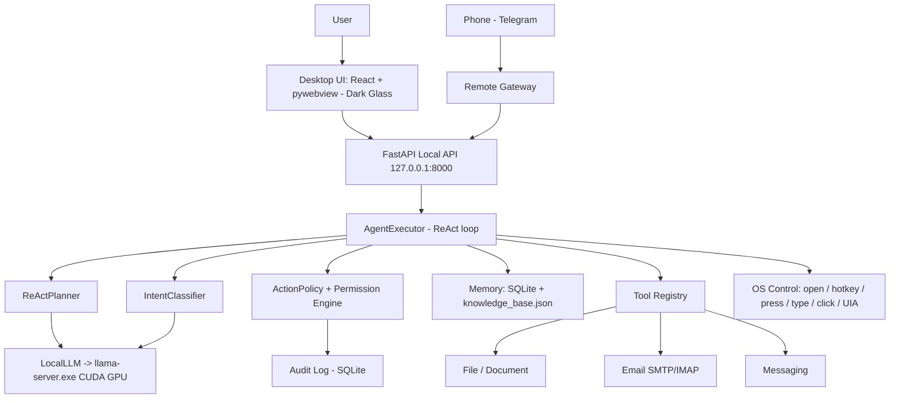

# CONTROLPC Design & Implementation Plan — v2.0

> **v2.0 (2026-06)** re-synced with the actual current state of the code after a major upgrade:
> moved inference to **GPU (llama-server CUDA, no Ollama)**, **fixed all reviewed bugs**,
> and **rebuilt the UI toward Dark Glassmorphism**. The v1 build (light theme, CPU) still lives in
> git history. The core safety philosophy of v1 is preserved — only the outdated parts are updated.

CONTROLPC is a local virtual assistant on Windows whose primary goal is to perform simple, repetitive office tasks on the user's behalf: opening files, finding documents, writing reports, sending emails, replying to messages, filling out forms, saving results, and reporting status back.

This application is a **narrow and safe** machine-control assistant: **no free web browsing, no internet lookups, no skill marketplace** — it focuses solely on controlling the local computer per the user's commands, with the ability to extend to receiving commands from a phone via Telegram/Zalo/WhatsApp.

Invariant principle: **do not turn the AI into a free-roaming mouse cursor**. Always prefer reliable, verifiable, low-risk control channels (CLI, internal APIs, file system, SMTP/IMAP, Windows UI Automation, official connectors). Coordinate-based clicking is a last resort: it must request permission, display the location, and have an emergency stop button.

---

## 1. Product Goals

### 1.1. Primary goals
- Open applications and files: Word, Excel, PDF, images, folders, project files, internal network paths.
- Search for files: by name, extension, folder, modification time.
- Write reports: create drafts from a request, manually entered data, a template file, or the contents of an existing file.
- Send email: compose, attach, send to confirmed recipients.
- Reply to messages: compose drafts; auto-send only when permission allows.
- Manage output files: save to the correct folder, preview, ask for confirmation before sending.
- Report progress: let the user see what the agent is doing, has done, and still has left to do.
- Receive remote commands: from authenticated accounts, converted into moderated local tasks.

### 1.2. Out of scope in the early phase
- Do not handle financial transactions, purchases, money transfers, contract signing, or bulk data deletion on its own.
- Do not auto-send sensitive emails/messages without a final confirmation.
- Do not auto-click dangerous buttons (Delete, Send, Submit, Pay, Confirm) without sufficient permission.
- Do not control every piece of software via mouse coordinates. Coordinates are a fallback.
- No free web browsing / internet lookups / interacting with websites outside configured connectors.
- Do not install skills/plugins from external sources.

### 1.3. Success criteria
- "Write today's work report and send it to Nam" → ask for missing info, create the file, let it be reviewed, request confirmation, send.
- "Open the latest quotation file in project A" → search, show candidates, open via the system mechanism.
- "Reply to this message saying I'll send it before 5 o'clock" → compose a draft, display it, send only when permitted.
- Every risky action has a log, status, permission, and a stop button.
- Phone commands are accepted only from the allowlist + an additional confirmation for high-risk tasks.

---

## 2. Computer Control Principles

### 2.1. Action priority order (MANDATORY)
1. **Official API / protocol** — SMTP/IMAP, Telegram Bot API; Office/PDF via file libraries; (later) Graph/Gmail/Outlook COM.
2. **CLI & file system** — `os.startfile`, launch apps by known executable path, create/rename/copy/save via OS APIs, allowlisted commands.
3. **Windows UI Automation (UIA)** — find controls by `AutomationId`/`Name`/`ControlType`/`ClassName`, click/input via the UI tree.
4. **Hotkey** — only when the app has stable shortcuts and the correct window is focused.
5. **Vision + coordinate click** — only when the 4 methods above are infeasible; must have a screenshot + marker + reason + confirmation; not used for send/delete/submit without a final confirmation.

There is no "free web browsing" tier. Every online interaction must go through a specific configured connector + be allowed by policy.

### 2.2. CLI vs. mouse-click permissions
| Channel | Priority | Default risk | When to use | Confirmation |
|---|---:|---:|---|---|
| Read files/folders | High | Low | Find/read input data | None if in allowlist |
| Create draft file | High | Low | Write reports, create drafts | None / light |
| Open file/app via CLI | High | Low/Med | Open Word/PDF/Excel/app | None if in allowlist |
| Send email via API | High | High | Send a real email | Always final confirmation |
| Receive phone commands | High | Med/High | Create task from Telegram… | Authenticate sender; high-risk needs confirmation |
| UIA click control | Med | Med | Click a recognized button | Confirm if risky |
| Hotkey | Med | Med | Save/copy/switch tab | App focus + policy |
| Coordinate click | Lowest | High | Fallback | Always confirm + preview |

### 2.3. Mandatory safety rules
- Every action goes through `ActionPolicy` before running.
- Every action has an `action_id`, `risk_level`, `target`, `reason`, `rollback_hint`.
- High-level actions (sending email/messages, deleting/overwriting/uploading files) require a final confirmation.
- Always have a Stop/Emergency Stop button.
- Do not store raw passwords (see §15 — to-do item: Credential Manager/DPAPI).
- Do not bypass CAPTCHA/MFA/security confirmations on its own.
- Phone commands do not run shell/clicks directly; they must go through policy + confirmation.
- Every remote command has a `source_channel`, `sender_id`, `auth_level`, `task_id`.

---

## 3. User Workflows

### 3.1. Send an email with attachments
> "Write an email to Nam reporting today's progress, attach the file I just created."

Classify → ask for missing info (recipient, specific email, tone, which file) → create draft → preview (To/CC/Subject/Body/Attachments) → check file (exists, size, extension) → final confirmation → send via connector → log (time, recipient, subject, file, status). Do not click "Send" if SMTP/API is available.

### 3.2. Reply to a message
> "Reply to Hằng that I'll send the report before 5 o'clock."

Determine the channel (connector preferred; if no API, use UIA on an allowlisted desktop app) → compose draft → preview → follow the contact's permission (`draft_only` / `confirm_before_send` / `auto_send_allowed`) → log. No free browser automation.

### 3.3. Open a file
> "Open the latest quotation file for the The Sun project."

Search within the allowlist (Desktop/Documents/Downloads/project folder) → if multiple candidates, display them (name/path/modification date/size) → pick one or "the latest" → open via `os.startfile`. Do not click desktop icons by coordinates.

### 3.4. Write a report then send the file
Understand the report type → gather data (user content + source files + template + memory if permitted) → create draft → save to `workspace/output` or the project folder → preview/export PDF if needed → confirm → send/attach the draft.

### 3.5. Receive a command from a phone
The remote gateway receives the message → check the `source_channel`+`sender_id` allowlist → resolve sender permissions (`view_status`/`create_task`/`approve_high_risk`/`admin`) → create a local task (not run directly from the message) → low-risk may run per policy; high-risk sends a preview + requires PIN/approve → send a summary of the result back to the phone. Phone commands do not run shell / do not click coordinates directly / do not actually send without confirmation.

---

## 4. Overall Architecture



### 4.1. Main layers
- **UI Layer** — chat, action timeline, approval cards, email/file preview, screen monitoring, UIA inspector, settings, Stop. (Dark glassmorphism.)
- **API Layer** — FastAPI on `127.0.0.1:8000`, status polling, settings export/import.
- **Agent Orchestrator (`AgentExecutor`)** — task lifecycle, ReAct steps, running tools, saving results; a background worker drives the next step.
- **LLM Layer (`LocalLLM`)** — **calls the GPU via llama-server.exe (CUDA)**; see §6.
- **Action Policy** — risk classifier + permission + confirmation + allowlist/blocklist.
- **Tool Registry** — file/document/email/messaging with clear schemas.
- **Memory** — SQLite (`chat_logs`, `audit_logs`, `remote_senders`) + `knowledge_base.json` (app paths).
- **Remote Gateway** — Telegram: authenticate the sender + convert into a local task.

---

## 5. Local GPU Inference (LocalLLM)  ⚡ NEW

> This is the biggest architectural change versus v1. Before: `llama-cpp-python` ran on **CPU** (very slow).
> Now: **100% GPU** via a `llama-server.exe` process (the CUDA build of llama.cpp).

### 5.1. Technical decision
Target environment: **RTX 5060 (Blackwell, 8GB) + Python 3.14 + no CUDA toolkit yet**.

| Option | Conclusion |
|---|---|
| `llama-cpp-python` CUDA build in-process | ❌ On Python 3.14 + Blackwell: no prebuilt wheel; building from source needs CUDA 12.8 + MSVC — high risk, many hours. |
| Ollama | ❌ The user does not want to depend on the Ollama service. |
| IronPython | ❌ Cannot load native/CUDA libraries — infeasible for an LLM. |
| **`llama-server.exe` (CUDA) bundled** | ✅ **Chosen.** Reuse the existing CUDA 13.3 build, offload 100% to GPU, self-contained within the app folder, ~85 tok/s. |

### 5.2. How it works (`backend/app/agent/llm.py`)
- `LocalLLM` **lazily** launches a `llama-server.exe` process on the first inference:
  `-ngl 99` (offload all layers to GPU) · `-c 8192` · `--host 127.0.0.1 --port <free>` · `--log-disable`.
- **Model-agnostic** (`POST /v1/chat/completions`): llama-server automatically applies the **chat template taken from the GGUF itself**, so switching between Gemma / Qwen3 / another model only requires swapping the `.gguf` file — no code changes. Thinking is turned off (`enable_thinking=false`) so answers/JSON do not include `<think>`.
- **Model selection**: env `CONTROLPC_LLAMA_MODEL` → `config/model_settings.json` (`model_path` + `context`, set from the UI) → other app env → bundled model. Enable `-fa` (flash-attention) to reduce the KV-cache, helping a ~9B model fit in 8GB.
- Currently running **Qwen3.5-9B (Q5_K_M, ~6GB)** at `context 4096` — verified to fit entirely on the GPU; also runs gemma-4-E4B. Poll `/health` (cold start 15–40s); auto-shutdown on exit (`atexit`).
- **JSON-constrained output**: pass `json_schema` (response_format) to force the model to return valid JSON (planner).

### 5.3. Binary + model discovery (in order)
1. Environment variables `CONTROLPC_LLAMA_SERVER` / `CONTROLPC_LLAMA_MODEL`.
2. In the repo: `<repo>\llama\llama-server.exe` and `<repo>\models\gemma-4-E4B-it-Q4_K_M.gguf`.
3. Known fallback location (reuse a neighboring project's CUDA build + model) — avoids copying ~6GB.

> Deployment recommendation: copy the `llama\` folder (CUDA build) + the `.gguf` file into the repo, or point to them via an env var.
> `requirements.txt` has **dropped `llama-cpp-python`** (and the unused `opencv`); only `requests` is needed to call the server.

---

## 6. Directory Structure (ACTUAL CURRENT STATE)

> **Portable** paths (no more `C:\1 CODE\CONTROLPC`): `start.bat` uses `%~dp0`,
> `permissions.json` uses the `${WORKSPACE}` token and `%USERPROFILE%` (expanded by `permissions.py`).

```text
controlpc/
├── backend/
│   ├── app/
│   │   ├── main.py                 # FastAPI app + endpoints + background worker
│   │   ├── agent/
│   │   │   ├── executor.py         # AgentExecutor (ReAct loop, task lifecycle)
│   │   │   ├── planner.py          # IntentClassifier + ReActPlanner + ActionDecision
│   │   │   ├── llm.py              # LocalLLM -> llama-server.exe (GPU CUDA)
│   │   │   └── prompts.py
│   │   ├── policy/                 # action_policy.py · risk.py · permissions.py
│   │   ├── tools/                  # registry · file · document · email · messaging
│   │   ├── core/                   # os_control · uia_control · discovery · safety · paths (brain resolver)
│   │   ├── database/               # memory.py (CODE only — runtime data lives in .controlpc/state)
│   │   └── integrations/           # telegram · smtp_imap · contacts
│   ├── requirements.txt            # dropped llama-cpp-python + opencv; unpinned for Py3.14
│   └── run_backend.py
├── frontend/                       # React 19 + Vite — Dark Glassmorphism
│   └── src/  (App.jsx · App.css · index.css)
├── config/                         # SHIPPED defaults (git-track): permissions · contacts · email/messaging · knowledge_base.seed.json
├── remote_gateway/telegram_bot.py
├── workspace/  (input · output · templates)   # USER FILES (separate from the brain)
├── docs/
├── llama/      (optional — CUDA binary, .gitignore)
├── models/     (optional — *.gguf, .gitignore)
└── desktop.py · start.bat · test_*.py

# 🧠 AGENT BRAIN — NOT inside the repo. Default: %LOCALAPPDATA%\ControlPC
#    (e.g. C:\Users\<user>\AppData\Local\ControlPC) — writable even when installed under Program Files.
#    Override: CONTROLPC_BRAIN_DIR. Auto-created on first run.
%LOCALAPPDATA%\ControlPC\
├── brain.json                       #   manifest + schema_version (migration marker)
├── config/                          #   dynamic config (copied from repo /config on first run)
├── state/                           #   LONG-TERM MEMORY: history.db + knowledge_base.json (back this up)
├── logs/  cache/  run/              #   logs · temp screenshots · drafts being composed
```

> **Brain separated from code** (OpenClaw `~/.openclaw` style + `%LOCALAPPDATA%` standard): all runtime state/memory is written to
> `%LOCALAPPDATA%\ControlPC` (override `CONTROLPC_BRAIN_DIR`), organized by lifecycle (config/state/logs/cache/run).
> `backend/app/core/paths.py` is the ONLY place that resolves paths + creates the tree + migrates old data (copies history.db to keep
> the hash-chain intact). User files live in `<repo>/workspace`; secrets live in Credential Manager, not on disk.

> The v1 modules proposed but **not yet implemented** (a separate orchestrator/schemas/state, validators, cli_tool, hotkey_tool, vision_click_tool, gmail/outlook/whatsapp/zalo) — see roadmap §15. The architecture is intentionally flat & lean for the right MVP scale.

---

## 7. Action Schema, Risk, Confirmation

Each policy evaluation returns: `action_id`, `tool`, `intent`, `risk_level`, `decision`, `confirmation_mode`, `target`, `params`, `reason`, `preview{title,summary}`, `rollback_hint`.

- **Risk**: `low` (read/search/draft/open allowlisted app) · `medium` (write/rename/open app outside allowlist/UIA/type/hotkey) · `high` (send email/messages, overwrite/delete file, system command, coordinate click) · `blocked` (delete system folders, write to `C:\Windows`/`Program Files`/`AppData`…).
- **Confirmation**: `none` · `notify` · `confirm_once` · `confirm_final` · `manual_only`.
- **The `safety_confirmation` flag** (fixed so it actually HAS an effect): when ON, every `allowed` action (except `finish`/`learn`) is raised to `confirm_once`; when OFF, low-risk actions run automatically while high-risk actions still require confirmation per their risk.
- **Remote command schema**: `source_channel`, `sender_id`, `auth_level`, `task_id`, PIN for high-risk.

---

## 8. Permission Model
- **File**: `allowed_read_dirs`, `allowed_write_dirs`, `blocked_dirs`, `allowed_extensions`, `max_attachment_mb`. Supports the `${WORKSPACE}` token (repo root) + environment variables (`%USERPROFILE%`…) → portable across every machine/user.
- **App**: `launch` (`allow`/`confirm`/`block`) + `allowed_commands` for cmd/powershell.
- **Contact**: `draft_only` / `confirm_before_send` / `auto_send_allowed` / `blocked`.
- **Remote sender**: `enabled`, `auth_level`, `can_create_task`, `can_approve_high_risk`, `requires_pin_for_high_risk`, `pin` (default `1234`, override via env `CONTROLPC_REMOTE_PIN` — **change it before enabling real remote access**).
- **Safety settings**: `coordinate_click_enabled=false`, `remote_gateway_enabled=false`, `auto_send_messages=false`, `default_action_policy=confirm_once`.

---

## 9. Tool Registry — Implementation Status

| Tool | Functions | Status |
|---|---|---|
| File | `file.search/open/copy/rename/create_folder` | ✅ Done (`file.preview_metadata` not yet) |
| Document | `document.read_text/summarize/create_docx` | ✅ Done (`create_pdf`, `fill_template` not yet) |
| Email | `email.create_draft/send/validate_recipient/attach_file/list_recent` | ✅ Done (SMTP/IMAP) |
| Messaging | `message.create_draft/send/find_contact/open_thread` | ✅ Done |
| OS actions | `open/hotkey/press/type/click/click_uia/learn/finish` | ✅ Done |
| UIA | `list_windows`, `get_control_tree`, `click_uia` | ✅ Done |
| CLI tool | `cli.run_allowlisted` | ⛔ Not yet (only an allowlist in config) |
| Vision click | `vision.locate/propose/confirm` | ⛔ Not yet (only coordinate clicking so far) |
| Integrations | gmail/outlook/whatsapp/zalo | ⛔ Not yet (only Telegram + SMTP/IMAP) |

> **Fixed**: the planner was previously locked to a schema of only 8 OS actions, so it **could not call** the file/email/document/messaging tools. Now `ActionDecision.action` accepts `OS actions ∪ TOOL_REGISTRY` (still rejecting invalid actions) and the prompt lists the tools → the planner can call real tools.

---

## 10. Agent Loop & Planner Reliability
- States: `idle` · `running` · `waiting_approval` · `finished` · `error` · `paused`.
- The background worker (0.5s) drives `next_step()` when `running` and there is no pending action; each step: plan → policy → (wait for approval if needed) → execute → log → next step. `max_steps=12`.
- **Reliability with a small model (E4B)**: the planner forces **valid JSON via llama-server's `json_schema`** + **bounded retries** when parsing/validation fails; on a real LLM error it reports the error clearly and **does not silently fall back to mock**. Mock mode is kept separate for demo/test.

---

## 11. User Interface — Dark Glassmorphism  🎨 (REPLACES §10 of v1)

> **A reversal from v1.** v1 mandated a light theme and banned glassmorphism. Per the user's new requirement,
> the current UI standard is **modern Dark Glassmorphism** (implemented in `frontend/src/`).

### 11.1. Design tokens (`index.css`)
- Background: dark gradient `#070a12 → #0f1525` + radial glows (indigo/cyan/blue).
- Glass panel: `rgba(255,255,255,0.045)` + `backdrop-filter: blur(18px)` + border `rgba(255,255,255,0.09)`.
- Accent: indigo→blue→cyan gradient (`--grad`); text `#e8ebf5`/muted `#79829c`.
- Risk: low `#3ddc97` · medium `#ffc24b` · high/blocked `#ff6b7d` · remote `#c08bff`.
- Inter + JetBrains Mono fonts; 16px rounded corners; smooth transitions; restrained slide-up/pulse/spin animations.

### 11.2. Layout (`App.jsx`)
- **Top bar**: gradient logo · connection status · **engine pill (GPU · Gemma‑4 / Mock)** · agent status pill (glows according to state).
- **Chat panel** (left): task header + step counter · message list (avatar + bubble; reasoning/success/error variants; **action cards colored by risk + inline Approve/Reject buttons**) · "thinking on GPU" indicator · composer (send/Stop).
- **Sidebar** (right, tabs): **Screen** (screenshot + reticle on click) · **Drafts** (email/message preview, badge when present) · **UIA** (select window + control tree) · **Settings** (mock/GPU engine, model path, safety toggles as switches).

### 11.3. UX principles kept from v1 (still apply)
- The Stop button is never disabled while running.
- Risk cards stand out but do not cause panic; they show a risk label + a short reason.
- No auto-scrolling that loses your reading position; unfamiliar icons have tooltips; dangerous buttons have clear text (not just color).
- Quick-action chips when idle (Find file / Write report / Compose email / Open app).
- (Still missing — see §15: an **Edit** button to revise content before approving; a `Ctrl+.` command palette; a separate activity timeline.)

---

## 12. Memory & Local Data
- **Stored**: app paths (`knowledge_base.json`), contacts, email/report templates, task chat logs, audit logs, remote senders. SQLite: `chat_logs`, `audit_logs`, `remote_senders`.
- **Not stored raw**: passwords (CURRENTLY still stored in plaintext in `email_settings.json` — **technical debt, see §15**), unencrypted tokens.
- **Needs upgrade**: append-only/checksum-chain audit log; `tasks`/`folder_permissions` tables as proposed in the v1 schema.

---

## 13. Current Status (DONE)
- ✅ Backend starts reliably on **Python 3.14** (requirements unpinned; pillow/pywin32/pydantic… install fine).
- ✅ Policy/risk/permissions + audit log + confirmation.
- ✅ File/Document/Email(SMTP-IMAP)/Messaging tools + the planner can call tools.
- ✅ Telegram remote gateway + PIN + rate limit + per-sender audit.
- ✅ UIA list/tree/click; screenshot + reticle; settings export/import; rotating logs.
- ✅ **GPU inference via llama-server (CUDA), no Ollama** — verified running for real.
- ✅ **Fixed**: tool registry could not be called; `safety_confirmation` had no effect; hardcoded paths; nova leftovers; Win+R reporting false success; dead code; CORS; safe-zone based on the real screen; PIN via env.
- ✅ **UI rebuilt** in Dark Glassmorphism; clean build.
- ✅ **Reliable planner**: JSON-constrained (grammar) + 3x retry; verified to return correct ActionDecision on the GPU.
- ✅ **Secrets via Windows Credential Manager** (`keyring`) for the SMTP password / Telegram token (env fallback) + UI Settings → Security.
- ✅ **Tamper-proof audit log**: append-only SHA-256 hash-chain + `/api/audit/verify` (tested to detect tampering; skips legacy rows).
- ✅ **Edit-before-approve**: revise email/message content directly in the approval card before sending.
- ✅ **UX**: quick-action chips when idle + a "System status" checklist in Settings.
- ✅ **Model-agnostic** (`/v1/chat/completions`, template from the GGUF) + model selection in the UI; currently running **Qwen3.5-9B** on the GPU (verified: classify/plan/chat correct, "Hanoi").
- ✅ **Self-contained**: the `llama\` engine (CUDA build) + `models\` (gemma-4-E4B, Qwen3.5-9B, Qwen3-8B) bundled in the repo; resolution prefers local; no dependency on external apps/folders.
- ✅ **SSE streaming** chat reply (token-by-token, live bubble) — verified on the GPU.
- ✅ **Structured control instead of coordinate clicking** (OpenClaw/UFO): the `shell.run` tool (PowerShell/CLI allowlist), a prompt that bans coordinate clicking, clicking blocked by default.
- ✅ **Disambiguation to open the right app**: strong scoring (penalize monitor/worksharing/viewer…, prefer exe + fewer extra tokens) → "revit" resolves to "Revit 2024"; if ambiguous, it asks again. Verified.
- ✅ **Skill library (Voyager)**: verified goal→plan cache, replay without an LLM, re-plans automatically when stale — smoother the more it is used. Patterns recorded at `.claude/patterns.md`.
- ✅ **Brain consolidated in one place** (OpenClaw style): default `%LOCALAPPDATA%\ControlPC` (override `CONTROLPC_BRAIN_DIR`); `core/paths.py` resolves + auto-creates + migrates; separates state/memory from code & user files; audit hash-chain stays intact; auto-created on first run on any machine.
- ✅ **Markdown memory (OpenClaw-style)**: after each completed task, write `memory/journal/YYYY-MM-DD.md` + update `memory/MEMORY.md` (known apps · frequent tasks · recent); **load MEMORY.md into the prompt** for the planner + chat → remembers more the more it is used. 🧠 Memory tab + `/api/memory`.
- ✅ **Lean settings** + **model-selection dropdown** (`/api/models/list` scans `/models`).
- ✅ **Telegram remote (mobile) COMPLETE, free**: long-polling integrated in the backend (no separate process/public IP needed), token from Credential Manager; enable/disable + grant permission (Telegram ID + PIN) right in the UI (the 📱 section); auto-start on boot if enabled. `/api/remote/status|toggle|set_owner`. Zalo/WhatsApp = roadmap (require business APIs).
- ✅ Tests: `test_policy/planner/tools/smoke/remote` PASS + completion-pass checks (secrets/audit/edit) PASS + Qwen3.5 GPU verify PASS.

---

## 14. Next Upgrade Roadmap (ROADMAP v2)

**Completed in the completion pass (2026-06):** ✅ JSON-constrained planner + retry · ✅ Edit-before-approve · ✅ Secrets (Credential Manager) · ✅ Audit hash-chain · ✅ System status checklist + quick-action chips · ✅ Model-agnostic inference + model selection in the UI (currently using Qwen3.5-9B on the GPU).

**Remaining (prioritized by value/low risk):**
1. ~~Stream tokens to the UI (SSE)~~ ✅ **Done**: `/api/chat/stream` + `llm.generate_stream` + a live bubble with a blinking cursor (smooth token-by-token chat reply; control commands still switch to polling).
2. **Audit hardening (the rest)**: add `tasks`/`folder_permissions` tables as proposed in the schema.
3. **File search index**: cache an index for fast lookups instead of walking folders.
4. **Vision click fallback**: screenshot → propose marker → approve → click (block dangerous labels). *(Requires an OCR/vision model.)*
5. **Document**: `create_pdf` (reportlab + a Unicode font for Vietnamese), `fill_template`.
6. ~~CLI tool~~ ✅ **Done** (`shell.run`, allowlist + high-risk confirm).
7. **UX**: `Ctrl+.` command palette, a separate activity timeline.
8. **Connector expansion**: Outlook/Gmail/Graph; then WhatsApp Business/Zalo OA *(require real accounts/APIs — avoid web automation)*.
9. **Packaging**: installer + bundling `llama/` + model; full health check.
10. ~~Upgrade the model~~ ✅ **Done**: currently running Qwen3.5-9B (swap to any model right in the UI). Qwen3-8B (`E:\QWEN\Main\Qwen_Qwen3-8B-Q5_K_M.gguf`) can be tried if an official instruct build is preferred.

---

## 15. Test Suite
- **Backend**: app imports without errors; `/api/status` returns status; policy blocks `blocked`; `email.send` requires confirm; file search only within the allowlist; UIA does not crash when the package is missing. *(PASSED, paths are portable.)*
- **Frontend**: `npm run build` passes *(PASSED)*; `npm run lint`; approval matches risk; preview does not overflow; Stop is always usable.
- **E2E (target)**: open file via CLI; find the latest file; create docx; create an email draft with attachment; send email after confirmation; compose a message draft; remote allowlist creates a task; reject an unknown sender; PIN for high-risk remote; click fallback requires approve.

---

## 16. Self Red-Team Review (kept from v1 — still valid)
1. **Not a fully privileged browser/click bot** — it only controls the machine via tools + can receive phone commands; no marketplace, no free web, no installing extensions.
2. **The remote gateway is not a second agent** — it only receives commands + sends status; it does not decide tools on its own; it does not call CLI/UIA/click directly; it only creates standardized local tasks.
3. **Mouse clicking is not a primary capability** — it is a fallback; it must have a marker + approval; it is not used to send/delete/submit when another channel exists.
4. **The LLM is not the policy** — the LLM only analyzes/proposes/writes; the **policy engine** decides whether something runs. The prompt does not replace the permission check.
5. **Mock is not mixed with production** — a model error must be reported clearly, not silently fall back to mock and then run a real action.

### 16.1. Behaviors that MUST NEVER be merged
- Running shell from user text without going through the allowlist.
- Coordinate clicks without a preview.
- Sending email/messages without a final confirmation.
- A non-allowlisted remote sender still creating a task.
- Storing raw tokens/passwords in the repo.
- Searching the entire drive on its own.
- Auto-enabling the remote gateway on first launch.
- Silently falling back to mock and then running a real action.
- Hiding the action log from the user.

> *Update note:* the v1 clause "the dark UI theme is the default = banned" has **been removed** — per
> the new requirement, Dark Glassmorphism is the current UI standard. All remaining safety clauses stay fully in effect.

---

## 17. Important Design Notes
CONTROLPC should not be built as a "look at the screen and click" program. The right direction is a **task assistant with clear tools**: sending mail, writing reports, opening files, replying to messages — most of which can be done via APIs/file system/document libraries/official connectors/UIA. Mouse clicking is only the very last layer.

The biggest risk is not in the UI or the LLM but in the **power to actually control the machine**. So the implementation order is always: **Policy → Safe tools → UI approval → Audit log → Remote gateway → UIA/hotkey/click fallback.** Reversing the order (doing click/remote before policy) would turn the project into a dangerous tool that is hard to debug and hard to trust.
